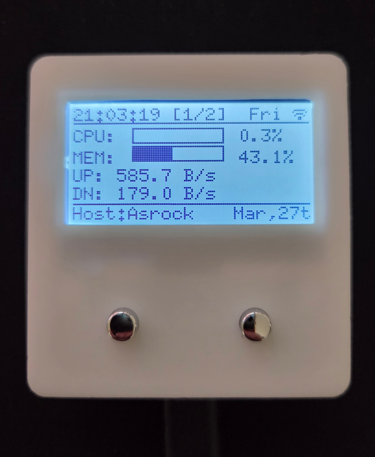
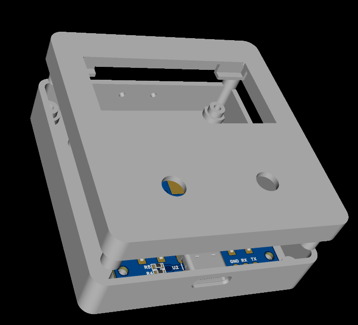

# PCMonitor

[中文说明](./README.md)

PCMonitor is a small hardware-plus-software desktop monitoring project:

- Device side: `ESP32-C5 + Arduino + PlatformIO`
- PC side: `FastAPI + WebSocket + psutil`
- The device reads PC status over WebSocket and renders it on a 128x64 LCD

The repository currently contains two main parts:

- Root directory: ESP32 firmware project
- [`server/`](./server/): Windows-side system monitor service

## Preview



## Features

- Shows CPU, memory, upload speed, download speed, date, and time on LCD
- Receives live PC status over WebSocket
- Persists runtime settings with LittleFS
- Supports multiple WebSocket servers with automatic failover
- Supports Wi-Fi captive portal provisioning
- Provides a built-in web configuration page
- Supports browser-based OTA firmware update
- Supports screen rotation, backlight brightness, and scheduled auto backlight
- Supports mDNS access via `http://monitor.local`

## Repository Layout

```text
PCMonitor/
|- src/                 ESP32 firmware source
|- data/                Initial LittleFS configuration
|- lib/                 Local libraries
|- server/              PC-side monitor service
|- doc/                 Schematics, pictures, and helper docs
|- platformio.ini       PlatformIO config
|- partitions.csv       Flash partition table
|- README.md            Chinese README
`- README_EN.md         English README
```

## Architecture

1. Run [`server/sysmonitor.py`](./server/sysmonitor.py) or the packaged `sysmonitor.exe` on the PC
2. The service samples local system stats once per second and pushes JSON to `/ws`
3. The ESP32 connects to that server on the same LAN
4. The device refreshes the LCD after receiving new data

The firmware currently expects a payload roughly like this:

```json
{
  "time": "2025-10-14 18:02:02",
  "name": "MyPC",
  "week": "Tuesday",
  "cpu_usage": 12.3,
  "memory_usage": 48.7,
  "network": {
    "up": "14.4 KB/s",
    "down": "15.4 KB/s"
  }
}
```

## Firmware

The firmware uses PlatformIO. The target board configured in [`platformio.ini`](./platformio.ini) is:

- `esp32-c5-devkitc-1`
- framework: `arduino`
- filesystem: `LittleFS`

Main dependencies include:

- `U8g2`
- `WiFiManager`
- `ArduinoJson`
- `WebSockets`
- `OneButton`
- `TimeLib`

### Pin Mapping

Defined in [`src/main.h`](./src/main.h):

- `KEY_B1 = GPIO9`
- `KEY_B2 = GPIO0`
- `LED = GPIO10`
- `DIS_RST = GPIO4`
- `DIS_DC = GPIO5`
- `DIS_SCK = GPIO6`
- `DIS_SDA = GPIO7`
- `DIS_BL = GPIO8`

### Button Behavior

Based on the current firmware:

- `B1` click: toggle backlight on/off
- `B2` click: switch to the next WebSocket server
- `B2` long press then release: reboot the device

### Default Device Config

The initial LittleFS config file is [`data/config.json`](./data/config.json).

Example:

```json
{
  "ssid": "your-ssid",
  "psw": "your-passwd",
  "wifiBand": "5g",
  "backlight": 50,
  "rotation": 2,
  "currentIdx": 0,
  "autoBacklight": false,
  "onTime": "07:50",
  "offTime": "23:50",
  "servers": [
    "192.168.1.100:8000/ws"
  ]
}
```

## PC Monitor Service

The PC-side service lives in [`server/`](./server/).

It:

- reads local CPU usage
- reads memory usage
- calculates upload/download speed
- exposes HTTP and WebSocket endpoints with FastAPI
- can run as a tray application

### Dependencies

See [`server/requirements.txt`](./server/requirements.txt):

- `fastapi`
- `uvicorn[standard]`
- `psutil`
- `pystray`
- `pillow`

### Service Config

Default config file: [`server/config.json`](./server/config.json)

```json
{
  "name": "Asrock",
  "host": "0.0.0.0",
  "port": 8000
}
```

Where:

- `name` is shown at the bottom of the device display
- `host` is the listening address
- `port` is used for both HTTP and WebSocket

### Endpoints

- Home: `http://<host>:<port>/`
- Stats API: `http://<host>:<port>/api/stats`
- WebSocket: `ws://<host>:<port>/ws`

## Quick Start

### 1. Start the PC service

Inside [`server/`](./server/):

```bash
pip install -r requirements.txt
python sysmonitor.py
```

You can also run the bundled `sysmonitor.exe` after editing `config.json` in the same folder.

### 2. Build and flash the firmware

From the project root:

```bash
pio run -e usb
pio run -e usb -t upload
```

If the device is already on the network and OTA is enabled, you can also use:

```bash
pio run -e wifi -t upload
```

Notes:

- `usb` uses serial upload
- `wifi` uses `espota`

### 3. Upload the LittleFS config

For first-time setup, it is recommended to upload [`data/config.json`](./data/config.json) into the filesystem:

```bash
pio run -t uploadfs
```

Edit the Wi-Fi and server values first so they match your own environment.

### 4. First-time Wi-Fi provisioning

If the device cannot connect to saved Wi-Fi credentials, it starts a captive portal:

- AP name: `MonitorV1.2`
- AP password: `11111178`

Connect to that AP and complete the Wi-Fi setup in the portal.

## Device Web Configuration

Once the device is online, open:

- `http://monitor.local`
- or the device IP address

The configuration page supports:

- editing Wi-Fi SSID and password
- selecting Wi-Fi band preference: `5G only / 2.4G only / Auto`
- setting backlight brightness
- setting LCD rotation
- setting auto backlight schedule
- editing multiple WebSocket server entries
- opening the firmware update page

## OTA Updates

The project supports two OTA paths:

- Arduino OTA
- Web OTA

Web OTA entry:

- `http://monitor.local/update`
- or `http://<device-ip>/update`

The firmware also keeps the `/ota` upload handler internally.

## Documentation Assets

The `doc/` directory contains:

- board and product pictures
- schematic PDF
- BOM spreadsheet
- Wi-Fi setup notes
- soldering helper page

Example image:

- 

## Development Notes

- Firmware version strings are currently defined in [`src/main.cpp`](./src/main.cpp):
  - `hw_ver = "1.2"`
  - `sw_ver = "1.3"`
- Default NTP server: `ntp6.aliyun.com`
- Current timezone in code: `UTC+8`
- mDNS hostname: `MonitorV1`

## Runtime Assumptions

- The PC service and device should be on the same LAN, or the device must be able to reach the configured server
- Windows Firewall may need to allow the configured port
- `monitor.local` depends on mDNS support in the local network environment
- `server/sysmonitor.exe` is a bundled artifact; if it behaves unexpectedly, prefer running the Python source version

## License

This project is licensed under the MIT License in [`LICENSE`](./LICENSE).
